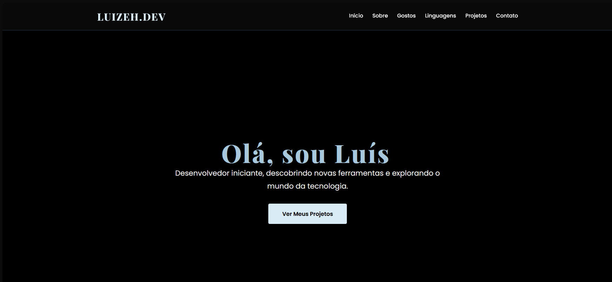

# Portfolio

### desenvolvimento, criatividade e identidade visual

 

---

## sobre

este é meu portfólio principal.

aqui estão reunidos projetos desenvolvidos inteiramente por mim, focando em:
- aprendizado em desenvolvimento web
- criação de interfaces
- estilização com CSS
- prática técnica
- experimentação visual
- exploração criativa

cada projeto representa parte do meu processo de aprendizado, criatividade e evolução como desenvolvedor.

---

## tecnologias utilizadas

| tecnologia | finalidade |
|---|---|
| HTML | estrutura |
| CSS | estilização |
| JavaScript | interatividade |

---

## objetivo

este repositório existe para apresentar meus projetos, estudos e evolução no desenvolvimento web.

cada atualização representa uma nova etapa do meu aprendizado e da construção da minha identidade como desenvolvedor.

---

## preview

---
